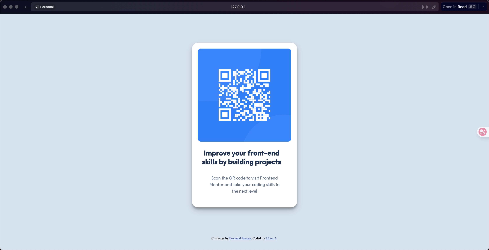

# Frontend Mentor - QR code component solution

This is a solution to the [QR code component challenge on Frontend Mentor](https://www.frontendmentor.io/challenges/qr-code-component-iux_sIO_H). Frontend Mentor challenges help you improve your coding skills by building realistic projects. 

## Table of contents

- [Frontend Mentor - QR code component solution](#frontend-mentor---qr-code-component-solution)
  - [Table of contents](#table-of-contents)
  - [Overview](#overview)
    - [Screenshot](#screenshot)
    - [Links](#links)
  - [My process](#my-process)
    - [Built with](#built-with)
    - [What I learned](#what-i-learned)
    - [Useful resources](#useful-resources)
  - [Author](#author)

**Note: Delete this note and update the table of contents based on what sections you keep.**

## Overview

### Screenshot

### Links

- Solution URL: [Add solution URL here](https://github.com/azumia-azu-front-mentor-solution/qr-code.git)
- Live Site URL: [Add live site URL here](https://your-live-site-url.com)

## My process

### Built with

- Semantic HTML5 markup
- CSS custom properties

### What I learned

I learned how to create a simple QR code component using HTML and CSS. I focused on structuring the HTML semantically and applying styles to achieve a clean and responsive design.

### Useful resources

- [W3 CSS Tutorial](https://www.w3schools.com/css/default.asp) - This resource was helpful for understanding CSS properties and how to apply them effectively in my project.

## Author

- Frontend Mentor - [@azumia-azu](https://www.frontendmentor.io/profile/azumia-azu)
